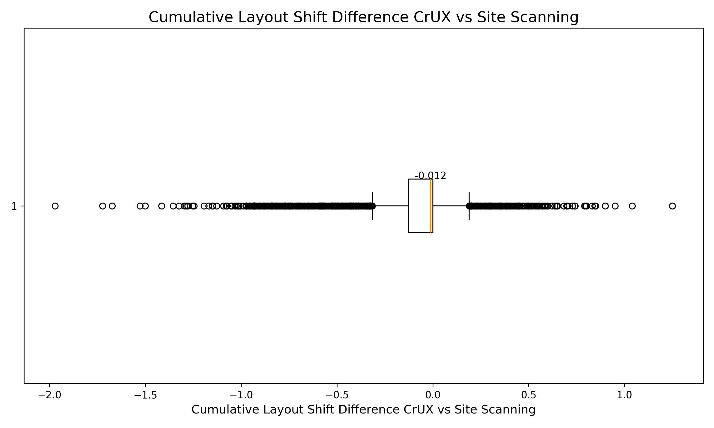
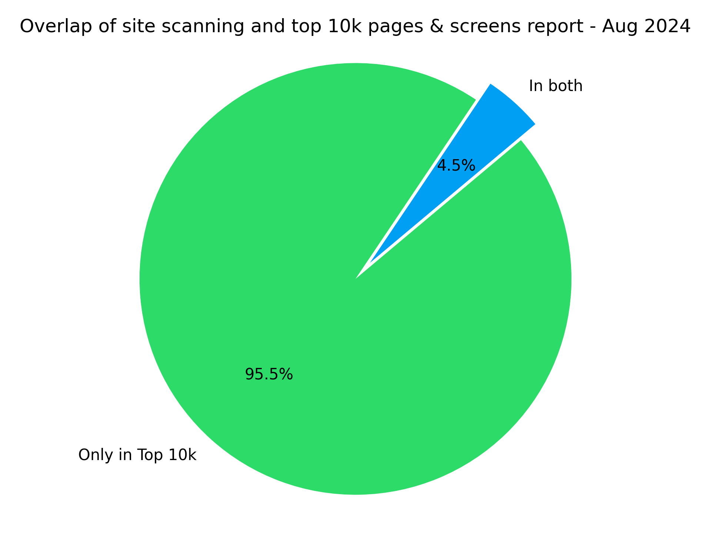

# Inclusive Web Performance and CX

This project contains research around web performance in the federal government to help hone in on a potential solution that can work at a large scale.

Currently, this project has a `research` directory that uses publicly available data sources to see where the gaps are in the current monitoring strategy for federal sites and applications, particularly for those users who might be on low or mid-tier mobile devices and/or limited data plans.

## Summary of findings:

### Variance between site scanning and the Chrome User Experience Report (CrUX) 

There is significant variance between the CrUX data and the info captured in the site scanning report as it pertains to Google's Core Web Vitals (CWV) metrics.

Largest Contentful Paint (LCP) is being underestimated in site scan with the median difference being 1154ms more than the site scanning report. (100ms is significant, so 1154ms is huge).


Cumulative Layout Shift (CLS) is being overestimated in the site scan with the median difference being 0.01 less than what real users experience.



- Of the sites that are in both the site scan and have enough data to show in CrUX, **21% say they are good for LCP in the scan but aren’t good in the CrUX data**. 6% say they are good in the site scan for LCP and aren’t good in the field data.
- Of the 3 CWV metrics, LCP is the most likely to fail for the origins in the site scan, which is consistent with the larger dataset as a whole.

#### Looking at the long tail of web performance
- At **p75**, the gov sites perform about the same as the larger dataset.
- At **p90**, the gov sites outperform the larger dataset for INP and CLS, but are much worse for LCP and passage of all CWV.


### Top Pages Report

We have also looked at how many URLs from the top-10k pages and screens report from analytics.usa.gov are also covered in the site scanning report. This shows whether the pages with the most views are represented in the site scanning report. 

There are 447 urls from the site scanning report that also appear in the top-10000 pages and screens report from [analytics.usa.gov](https://analytics.usa.gov).



There are 1253 distinct domains in the top 10k pages report, which means that there are domains that appear in the top 10k pages more than once.

#### How do the top pages perform?
In a random sample of 2500 urls from the top 10k pages, 1396 of them showed up in the CrUX report. Of the 1396 results, 904 urls were above the “good” threshold for one or more CWV metric at p75, 454 were classified as “good” for all 3 metrics at p75, and there were 68 who were outside the "good" threshold for all 3 metrics at p75. 

## Work to be done

Here are some of the questions we hope to answer:

- How can we help developers do the right thing?
- Top tasks?
  - Can we correlate bounce rate with perf data?
- What other metrics can we collect?
- Are there regions where we're slow?
- Are there things we can do with the cloud.gov platform?
  - 103 early hints
  - Compression
  - Etc
- What APIs aren't we using? Possible scenarios that need investigation:
  - Modern image formats (avif, webp)
  - Responsive images (e.g. `` or `<picture>`)
  - bfcache
  - 103 Early hints
  - Speculation rules api
  - Observers (intersection, performance, etc)
  - fetchpriority
  - yielding to the main thread (upcoming with `scheduler.yield`)

## Answered questions

- Look at top 10k. How many of those urls show up in site scan?
- Is CX speed good for the large majority of people? (p99 would be fantastic)
- Where are the gaps in the current strategy?
  - Are we scanning the right things?
    - How do people experience the urls that are accessed the most?

## Code formatting
To format code, use 

```bash
nbqa black <dir>
```

to lint
```bash
nbqa pylint <dir>
```

Source your venv
```bash
. path/to/venv/bin/activate
```

Install the cli apps
```bash
pip install --editable .
```
